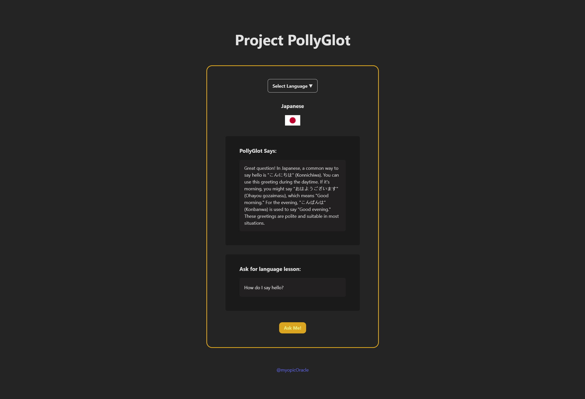

# Pollyglot - AI Language Learning Assistant

**Purpose:** I built this project to cement what I had learned about using the OpenAI library, making API calls to the 'chat' and 'response' endpoints, the difference between 'zero-shot' and 'few-shot' prompting, the impact of 'temperature' and 'stop-sequences', as well as 'frequency penalties' and 'presence penalties', through Scrimba's ["Intro to AI Engineering"](https://scrimba.com/the-ai-engineer-path-c02v) course in the ["AI Engineer Path"](https://scrimba.com/intro-to-ai-engineering-c032).

**Function:** Concise, AI-powered language lessons for travellers, students, or professional pollyglots. Users can choose from 12 languages: Arabic, Australian (a lighthearted Easter Egg), Chinese, Dutch, French, German, Hebrew, Italian, Japanese, Portuguese, Spanish, and Urdu.

           

#### Live Link: https://project-pollyglot.vercel.app/



## Note on the OpenAI API & Free Alternatives

### **Re: OpenAI API** 
OpenAI no longer offers $5 in credit to new users, but I highly recommend making the investment over free options like Gemini API. In addition to the excellent documentation:

- The [*Fine-Tuning*](https://platform.openai.com/finetune) tool allows you to, using either the GUI or API, create fine-tuning jobs from JSONL datasets and use your saved models. It offers less control and deployment options compared to alternatives than SageMaker AI, but is still quite powerful if you're just getting started. 
- The [*OpenAI Playground*](https://platform.openai.com/chat) allows you to do 'back-of-the-napkin' model evals and experiment with different models (including your own fine-tuned models!) by saving your parameters in unique code snippets
- For more methodical evals, you can use the [*Model Evaluation*](https://platform.openai.com/evaluations) tool and by referencing the [*eval documentation here*](https://platform.openai.com/docs/guides/evals?api-mode=responses) as well as the [*model optimization docs here*](https://platform.openai.com/docs/guides/model-optimization)

### **Re: Alternatives** 
If you're dead-set on a no-cost alternative, you can use the [*Gemini API OpenAI compatibility*](https://ai.google.dev/gemini-api/docs/openai) option. I've compiled some quickstart guides and working API calls in these files (located in [../docs](../docs/) and [../gemini-alt](../gemini-alt/)):
 
*Quickstart Guides*
- [Adapting OpenAI Library to use Gemini API Quickstart](../docs/Adapting_OpenAI_Library_to_use_Gemini_API_Quickstart.md)
- [Gemini API Quickstart](../docs/Gemini_API_quickstart.md)
- [OpenAI API Quickstart](../docs/Open_API_quickstart.md)

*Sample API Calls*
- [Gemini + Adapted OpenAI Implementation](../gemini-alt/gemini+adapted+openai_index.js)
- [Pure Gemini API Implementation](../gemini-alt/gemini_version_index.js)


## Project Notes

**AI Usage:** For this project, I really made an effort to use AI as little as possible. I also turned off tab-complete and React snippets. It came at the cost of less intricate design, but paid back in full in the form of my own sanity and helping me remember that I'm still capable of writing a full stack React/Node app without it.

I used AI to generate the README.md file, and to ask for clarification on dependencies, CORS configuration, and to debug the server setup, but I did not use AI to generate any of the actual code for this project. The code is quite simple, and mostly solidifies what I have been learning through *The Odin Project* and *Full Stack Open*.

**Starter Files:** The starter files provided for this project included **empty** *index.html*, *index.js*, and *index.css* files, as well as 5 images for the flags of France, Japan, Spain, a parrot logo, and a world map. While Figma design template was provided, I opted for a more minimalist approach. 

## Tech Stack

- **Frontend**: React, Vite
- **Backend**: Node.js, Express (or Cloudflare Workers for lightweight alternative)
- **AI**: OpenAI Models (or Gemini via the Gemini )
- **Styling**: External CSS

## Prerequisites

- Node.js (v16 or higher)
- npm or yarn
- OpenAI API key

## Local Development Setup

This project supports two development setups:

1.  **Full-Stack Local Server**: Run the React client and a Node.js/Express backend on your machine. This is ideal for developing and testing the backend server logic.
2.  **Client with Cloudflare Worker**: Run the React client locally and connect to a deployed Cloudflare Worker for API calls. This is a more lightweight setup that mirrors a serverless production environment.

### Option 1: Full-Stack Local Setup

#### Installation

1.  **Fork + Clone the repository**
   ```bash
   git clone git@github.com:[YOUR-USERNAME]/ai-eng-build-with-me.git
   cd ai-eng-build-with-me/project-pollyglot/pollyglot-app
   ```

2.  **Install dependencies**
   ```bash
   # Install root dependencies
   npm install
   
   # Install server dependencies
   cd server
   npm install
   cd ..
   ```

3.  **Environment Setup**
   - Create a `.env` file in the `server` directory
   - Add your OpenAI API key:
     ```
     OPENAI_API_KEY=your_api_key_here
     PORT=3001
     ```

#### Running the Application

1.  **Start the backend server**
   ```bash
   cd server
   npm start
   ```

2.  **Start the frontend development server** (in a new terminal)
   ```bash
   # From the project root
   npm run dev
   ```

3. Open your browser and navigate to `http://localhost:5173`

> **Note**: For this setup, ensure the `fetch` request in `src/components/Content.jsx` points to your local server: `http://localhost:3001/api/chat`.

### Option 2: Client with Cloudflare Worker

Follow these steps to set up the frontend client with a deployed Cloudflare Worker.

1.  **Set up the Frontend**
    - Follow steps 1 and 2 from the **Installation** section under **Option 1** to clone the repo and install the root dependencies.

2.  **Set up the Cloudflare Worker**
    - The `/pollyglot-cloudflare-worker` directory contains the source code for the worker.
    - You will need a Cloudflare account and the `wrangler` CLI installed and configured.
    
    ```bash
    # Install worker dependencies
    cd pollyglot-cloudflare-worker
    npm install
    
    # Save your OpenAI API key as a secret
    npx wrangler secret put OPENAI_API_KEY
    
    # Deploy the worker
    npx wrangler deploy
    ```

3.  **Configure and Run the Frontend**
    - In `src/components/Content.jsx`, update the `fetch` URL to your deployed Cloudflare Worker's URL.
    
    - Start the frontend development server from the root directory:
    ```bash
    npm run dev
    ```

## Project Structure

```
.
├── .gitignore
├── README.md
├── eslint.config.js
├── figma-template.md
├── index.html
├── package.json
├── pollyglot-cloudflare-worker
│   ├── .editorconfig
│   ├── .gitignore
│   ├── .prettierrc
│   ├── .vscode
│   │   └── settings.json
│   ├── .wrangler
│   │   ├── state
│   │   │   └── v3
│   │   │       ├── cache
│   │   │       │   └── miniflare-CacheObject
│   │   │       └── workflows
│   │   └── tmp
│   ├── package.json
│   ├── src
│   │   └── index.js
│   ├── test
│   │   └── index.spec.js
│   ├── vitest.config.js
│   └── wrangler.jsonc
├── public
├── server
│   ├── .env
│   ├── index.js
│   └── package.json
├── src
│   ├── App.css
│   ├── App.jsx
│   ├── assets
│   │   ├── arabic.webp
│   │   ├── australian.webp
│   │   ├── chinese.webp
│   │   ├── dutch.webp
│   │   ├── french.webp
│   │   ├── german.webp
│   │   ├── hebrew.webp
│   │   ├── italian.webp
│   │   ├── japanese.webp
│   │   ├── portuguese.webp
│   │   ├── spanish.webp
│   │   ├── urdu.webp
│   │   └── worldmap.png
│   ├── components
│   │   ├── Button.jsx
│   │   ├── Content.jsx
│   │   ├── Footer.jsx
│   │   ├── Header.jsx
│   │   ├── Input.jsx
│   │   ├── Language.jsx
│   │   └── Response.jsx
│   ├── index.css
│   └── main.jsx
├── tree.txt
└── vite.config.js

17 directories, 44 files

```

## Environment Variables

The following environment variables need to be set in `server/.env`:

- `OPENAI_API_KEY`: Your OpenAI API key
- `PORT`: Port for the backend server (default: 3001)

## Deployment

### Frontend (Vercel)
1. Push your code to a GitHub repository
2. Import the repository into Vercel
3. Set up environment variables in Vercel's dashboard
4. Deploy!

### Backend (Render)
1. Create a new Web Service on Render
2. Connect your GitHub repository
3. Set the root directory to `server`
4. Add environment variables
5. Deploy!

## Acknowledgments

- Scrimba for their excellent courses and practical approach to teaching AI Engineering, and [*Tom Chant*](https://github.com/DoubleNemesis) and [*Per Borgen*](https://github.com/perborgen) for their dedication to sharing knowledge. Highly recommend their *"The AI Engineer Path"* here: [https://scrimba.com/the-ai-engineer-path-c02v](https://scrimba.com/the-ai-engineer-path-c02v). IMO very worth getting the subscription.
